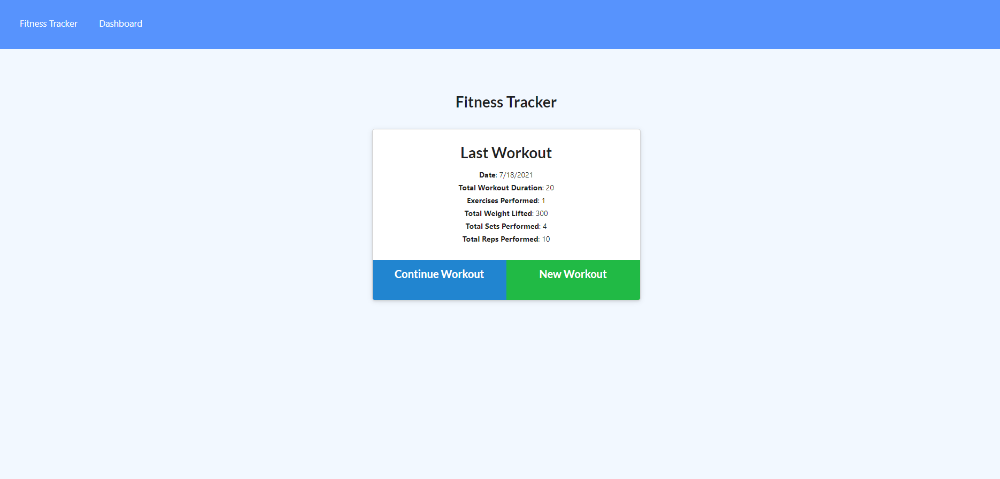
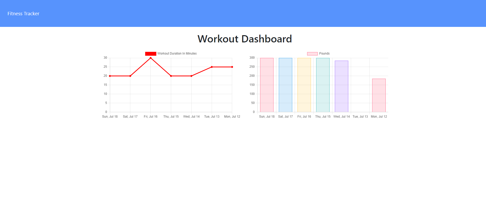

# workout_tracker

## Description

This application is a basic fitness tracker that enables a user to enter a workout comprised of multiple exercises. Once a workout has been added along with some exercises, the user is able to view their workouts for the past 7 days in terms of workout duration and the total amount of weight lifted for every given day.

[Click Here For the Deployed Application](https://cryptic-oasis-57512.herokuapp.com/)

The homepage and statistics screen of the application can be seen respectively in the screenshots below:

## List of Technologies
- Node.js
- Express
- MongoDB
- Mongoose
- Heroku